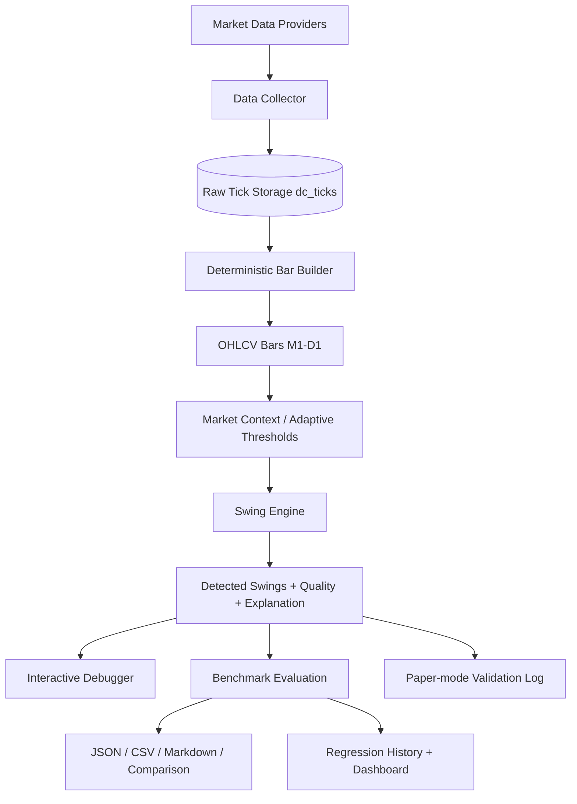

# Swing Detection Engine — Technical Documentation (Sprint 3)

## Architecture



## Module Map

| Module | Path | Responsibility |
|--------|------|----------------|
| Data Collector | `services/data_collector/` | Download, validate, persist ticks + candles |
| Bar Builder | `services/bar_builder/` | Deterministic UTC bar aggregation + rollup |
| Swing Engine | `swing_engine/` | **Only swing detection implementation** (versioned) |
| Market structure consumer | `services/quant_engine/swing_analysis.py` | Consumes `SwingEngine` for BOS/CHoCH/trend context |
| Scanner service | `services/scanner_service/` | Pipeline orchestration — imports swing_engine |
| Config | `config/swing_detection.yaml` | All thresholds |

## Swing Engine Pipeline

```
Bars → Market Context (adaptive) → Pivots → Noise Filter → ATR Validation
     → Leg Validation → Confirmation → Scoring → Scope/Tier/Confidence
     → Quality Score → Explanation → Output
```

### Public API

```python
from swing_engine import SwingEngine, SwingVisualizer, SUPPORTED_VERSIONS
from shared.types.models import Timeframe

# Versioned engine (default v1.2.0). Pass the symbol so gold/JPY sizing applies.
engine = SwingEngine(version="1.2.0")
result = engine.detect(bars, symbol="XAUUSD", timeframe=Timeframe.H1)

result.swings                        # List[DetectedSwing] (+ quality_score, explanation)
result.artifacts                     # PipelineArtifacts — intermediate stages
result.artifacts.market_context      # MarketContext — regime / session / volatility
result.performance                   # PerformanceMetrics — runtime / throughput
result.stage_logs                    # Per-stage counts for debugging

# Convenience helper (returns swing list only)
from swing_engine import detect_swings
swings = detect_swings(bars)
```

### Versioning

| Version | Description |
|---------|-------------|
| `1.0.0` | Baseline — strict pivots, legacy defaults |
| `1.1.0` | Equal-level pivots, expanded filters, tier scoring, protected levels |
| `1.2.0` | **Default** — adaptive thresholds (market context), 0–100 quality score, structured explainability |

Profiles in `config/swing_detection.yaml` under `version_profiles`. Per-symbol
overrides (e.g. `XAUUSD`) live under `symbol_overrides` and are passed via
`get_config(..., symbol="XAUUSD")` / `engine.detect(bars, symbol="XAUUSD")`.

```python
from swing_engine import SwingEngine, SUPPORTED_VERSIONS

v1 = SwingEngine(version="1.0.0").detect(bars)
v12 = SwingEngine(version="1.2.0").detect(bars, symbol="XAUUSD")
```

## Sprint 3 Additions

### 1. Adaptive Detection (`swing_engine/context.py`)

`compute_market_context()` snapshots conditions from the incoming bars, and
`adapt_config()` scales the static thresholds (never mutating the base config):

| Signal | Source | Effect when extreme |
|--------|--------|---------------------|
| Volatility regime | ATR percentile vs trailing window | High vol → wider pip/major thresholds; low vol → tighter |
| Structure regime | Kaufman efficiency ratio | Ranging → larger min leg + stricter pivots; trending → smaller min leg |
| Session | UTC hour (Asia/London/NY/Overlap) | Asia → wider distance + extra confirmation delay; Overlap → tighter |
| Spread | last bar range / ATR | Recorded for downstream spread gating |

Enabled only in the `1.2.0` profile (`adaptive.enabled: true`). The detector
behaves differently in a quiet Asian session than during the London–NY overlap.

### 2. Swing Quality Score (`swing_engine/quality.py`)

Every swing gets a `quality_score` (0–100) and a `quality_factors` breakdown so
downstream modules can ignore low-quality swings via `quality.min_acceptable`:

`confirmation`, `displacement`, `wick`, `atr_normalization`, `leg_symmetry`,
`liquidity_sweep`, `trend_alignment` — weighted in `config.quality.weights`.

### 3. Explainability (`swing_engine/explain.py`)

Each `DetectedSwing.explanation` is a `SwingExplanation` with `status`,
`summary`, `factors`, and `stage_scores`. Rejected candidates are explained in
`result.artifacts.decision_timeline` (`explanation` field) and surfaced as
hover text in the debugger.

### 4. Historical Regression Dashboard (`swing_engine/regression.py`)

Each benchmark run appends a row to `benchmarks/history/regression_history.jsonl`
and rebuilds `benchmarks/reports/regression_dashboard.html`, which shows
precision/recall/F1/delay per version with trend arrows.

### 5. Real-World / Paper Validation (`swing_engine/live_validation.py`)

`PaperSwingLog` records every detected swing (bar + wall-clock timestamp) to a
JSONL log. `compare_against_review()` scores the log against a human/benchmark
review file to report *live* precision, recall, and detection delay separately
from historical backtests. Runner: `scripts/paper_validate_swings.py`.

## XAUUSD (Gold) Support

- Gold pip size is `0.1` via `pip_size.symbol_overrides.XAUUSD` (silver `XAGUSD` = `0.001`).
- `symbol_overrides.XAUUSD` widens `leg.min_pips` / `noise_filter.min_pip_distance` to 5.0.
- Synthetic gold fixture: `tests.swing_detection.fixtures.gold_candles` (price ~2350).
- Benchmark: `python scripts/benchmark_swings.py --symbol XAUUSD --compare-versions 1.0.0 1.1.0 1.2.0`
- Labels: `benchmarks/labels/XAUUSD_H1.manual.json` (regenerate from human review).

## Algorithm (Sprint 2)

### Pivot Detection
- Configurable left/right lookback, equal-high/low tolerance, min pivot strength
- Optional body-extreme mode; pivot strength score (wick + body vs ATR)

### Filtering (independent, configurable)
- Noise: candle distance, pip distance, ATR movement, spread, volatility
- Consolidation and insignificant pullback rejection
- ATR validation and leg validation (optional same-direction legs)

### Confirmation
- Hold pivot for `min_candles` without violation
- Optional: displacement ATR, structure break, internal structure break, retracement
- Outputs: pivot candle, confirmation candle, delay, reasoning

### Strength Scoring
- Components: leg size, ATR, reaction, duration, volume, wick ratio, displacement, trend quality
- Returns **raw score** and **normalized score** (0–100)

### Classification
- **Major/Minor:** weighted tier score (leg ATR, strength, reaction, confirmation, duration)
- **Internal/External:** protected highs/lows, dealing range midpoint, HH/LL progression

### Versioning (API)

Implementations live under `swing_engine/versions/`. Compare engines without replacing prior logic:

```python
from swing_engine import SwingEngine, SUPPORTED_VERSIONS

v1 = SwingEngine(version="1.0.0").detect(bars)
# v2 = SwingEngine(version="2.0.0").detect(bars)  # when added
```

### Pipeline Artifacts

`PipelineArtifacts` stores intermediate results for debugging:

| Field | Description |
|-------|-------------|
| `pivot_candidates` | Raw pivot detections |
| `noise_filtered` / `noise_rejected` | After noise filter |
| `atr_validated` / `atr_rejected` | After ATR validation |
| `leg_validated` / `leg_rejected` | After leg validation |
| `confirmed_swings` / `unconfirmed_swings` | Post-confirmation |
| `atr_series` | ATR values aligned to bars |

### Performance Metrics

Each `engine.detect()` run records:

- Runtime (ms) per symbol/timeframe
- Bars processed per second
- Swings detected per second
- Peak memory (MB)

### Interactive Visualization

```python
from pathlib import Path
from swing_engine import SwingEngine, SwingVisualizer

result = SwingEngine().detect(bars, symbol="EURUSD")
SwingVisualizer().render_debug_html(result, bars, Path("debug/swing_debug.html"))
```

The HTML debugger shows candlesticks, candidate pivots, confirmed/rejected swings,
major/minor and internal/external coloring, confidence on hover, confirmation markers,
and optional ATR overlay.

```bash
PYTHONPATH=. python scripts/render_swing_debug.py --symbol EURUSD --output debug.html
```

### Chart overlay API

```python
viz = SwingVisualizer().build(bars, swings, artifacts=result.artifacts, window_start=..., window_end=...)
```

### DetectedSwing Fields

| Field | Type | Description |
|-------|------|-------------|
| `timestamp` | datetime | Pivot bar open (UTC) |
| `price` | float | Swing price level |
| `direction` | HIGH / LOW | Swing direction |
| `tier` | MAJOR / MINOR | Importance classification |
| `scope` | INTERNAL / EXTERNAL / NEUTRAL | Structure position |
| `confirmed` | bool | Passed confirmation rules |
| `confirmation_index` | int | Bar where confirmed |
| `confirmation_delay` | int | Bars from pivot to confirmation |
| `strength` | 1–5 | Institutional significance |
| `confidence` | 0–1 | Detection confidence |
| `quality_score` | 0–100 | Composite quality (Sprint 3) |
| `quality_factors` | dict | Per-factor quality breakdown |
| `explanation` | SwingExplanation | Structured accept/reject reasoning |
| `metadata` | dict | Leg ATR, scope score, components |

## Bar Builder

```python
from services.bar_builder import BarBuilder

builder = BarBuilder("EURUSD", Timeframe.M1)
bars = builder.from_ticks(tick_tuples)  # (ts, bid, ask, vol)
candles = builder.to_candles(bars)

# All timeframes from M1 ticks
all_tf = BarBuilder.build_all_timeframes("EURUSD", ticks)
```

**Guarantees:** UTC alignment, deterministic output, gap metadata on missing bars, no swing logic.

## Data Collection

- **10 FX symbols** configured in `config/data_collector.yaml`
- **Raw ticks** stored append-only in `dc_ticks` (immutable — duplicates ignored)
- **Dukascopy** provider persists ticks during download via `DataDownloader`

## Benchmark Evaluation (Sprint 2)

```bash
# Single version
PYTHONPATH=. python scripts/benchmark_swings.py --symbol EURUSD --timeframe H1 --regime trend

# Compare versions (also appends to regression history + rebuilds dashboard)
PYTHONPATH=. python scripts/benchmark_swings.py --compare-versions 1.0.0 1.1.0 1.2.0 --labels benchmarks/labels/EURUSD_H1.regression.json

# Gold
PYTHONPATH=. python scripts/benchmark_swings.py --symbol XAUUSD --compare-versions 1.0.0 1.1.0 1.2.0

# Visual debugger (v1.2.0 shows market context + quality + explanation)
PYTHONPATH=. python scripts/render_swing_debug.py --symbol XAUUSD --version 1.2.0 --bars 200 --output debug/swing.html

# Paper-mode validation
PYTHONPATH=. python scripts/paper_validate_swings.py --symbol XAUUSD --record
PYTHONPATH=. python scripts/paper_validate_swings.py --symbol XAUUSD --review benchmarks/labels/XAUUSD_H1.manual.json
```

### Metrics
Precision, Recall, F1, FP/FN, detection delay, price/time error, major/external precision/recall, average confidence/strength, repainting rate.

### Reports
JSON, CSV, Markdown summary, HTML version-comparison charts, and the historical
regression dashboard (`benchmarks/reports/regression_dashboard.html`).

Regression baseline: `benchmarks/labels/EURUSD_H1.regression.json`

### Ground Truth Format

```json
{
  "swings": [
    {
      "pivot_index": 42,
      "timestamp": "2025-01-03T14:00:00+00:00",
      "price": 1.0856,
      "direction": "HIGH",
      "tier": "MAJOR",
      "scope": "EXTERNAL"
    }
  ]
}
```

## Configuration

All parameters in `config/swing_detection.yaml`:

```yaml
pivot:
  left_lookback: 3
  right_lookback: 3
confirmation:
  min_candles: 2
  delay_bars: 2
classification:
  major_min_atr_multiple: 1.2
  major_min_strength: 4
adaptive:          # Sprint 3 — scaling factors by regime/session (enabled in 1.2.0 profile)
  enabled: false
quality:           # Sprint 3 — quality score component weights + min_acceptable
  min_acceptable: 50.0
pip_size:
  symbol_overrides:
    XAUUSD: 0.1
```

Merge order (later wins): base → `version_profiles` → `timeframe_overrides` → `symbol_overrides` → kwargs.

## Testing

```bash
PYTHONPATH=. python -m unittest discover -s tests/test_swing_engine_pkg -p 'test_*.py' -v
PYTHONPATH=. python -m unittest discover -s tests/swing_detection -p 'test_*.py' -v
PYTHONPATH=. python -m unittest discover -s tests/integration -p 'test_*.py' -v
```

Key test modules:
- `test_scoring.py` — tier/scope/confidence
- `test_edge_cases.py` — equal highs, gaps, regimes
- `test_benchmark_regression.py` — committed label regression
- `test_sprint3.py` — adaptive context, quality score, explainability, regression history, paper validation, XAUUSD

## Developer Notes

- **Single implementation:** all swing detection logic lives in `swing_engine/` only
- **Consumers:** `services/quant_engine/swing_analysis.py` imports swing_engine
- **No repaint:** confirmed swings depend only on bars through `confirmation_index`
- **No magic numbers:** all thresholds in YAML (`version_profiles` + `timeframe_overrides` + `symbol_overrides`)
- **Adaptive is additive:** `adapt_config` scales thresholds via `dataclasses.replace`; the base config is never mutated
- **Quality/explanation are advisory:** they annotate swings but never change which swings are detected
- **Default version:** `1.2.0`

## Version History

| Version | Date | Changes |
|---------|------|---------|
| 1.0.0 | Sprint 1 | Initial pipeline, artifacts, debugger scaffold |
| 1.1.0 | Sprint 2 | Equal-level pivots, expanded filters/strength, tier scoring, protected scope, decision timeline, benchmark reports |
| 1.2.0 | Sprint 3 | Adaptive thresholds (market context), 0–100 quality score, structured explainability, regression dashboard, paper-mode validation, XAUUSD/gold sizing |

## Future Integration

| Module | Consumes |
|--------|----------|
| Market Structure | `DetectedSwing.tier`, `scope`, confirmed highs/lows |
| BOS / CHoCH | External major swings as break references |
| Liquidity | Equal-level clusters from swing chain |
| Order Blocks | Last opposing candle before major displacement |
| FVG | Index gaps between confirmed swings |
| Decision Engine | `strength`, `confidence` as features |
