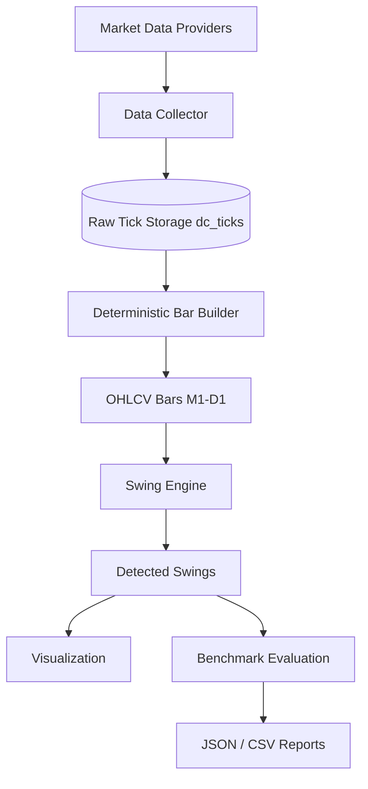

# Swing Detection Engine — Sprint 1 Technical Documentation

## Architecture



## Module Map

| Module | Path | Responsibility |
|--------|------|----------------|
| Data Collector | `services/data_collector/` | Download, validate, persist ticks + candles |
| Bar Builder | `services/bar_builder/` | Deterministic UTC bar aggregation + rollup |
| Swing Engine | `swing_engine/` | **Single source of truth** — versioned pipeline, artifacts, metrics |
| Legacy shim | `scanner/swing_detection/` | Thin re-exports + backward-compatible `detect_swings()` |
| Quant shim | `services/quant_engine/swing/` | Thin re-exports + `analysis.py` (BOS/CHoCH helpers) |
| Config | `config/swing_detection.yaml` | All thresholds |

## Swing Engine Pipeline

```
Bars → Pivots → Noise Filter → ATR Validation → Leg Validation
     → Confirmation → Scoring → Scope/Tier/Confidence → Output
```

### Public API

```python
from swing_engine import SwingEngine, SwingVisualizer, SUPPORTED_VERSIONS
from shared.types.models import Timeframe

# Versioned engine (canonical)
engine = SwingEngine(version="1.0.0")
result = engine.detect(bars, symbol="EURUSD", timeframe=Timeframe.H1)

result.swings              # List[DetectedSwing]
result.artifacts           # PipelineArtifacts — intermediate stages
result.performance         # PerformanceMetrics — runtime / throughput
result.stage_logs          # Per-stage counts for debugging

# Convenience helper (returns swing list only)
from swing_engine import detect_swings
swings = detect_swings(bars)

# Legacy shim (returns full DetectionResult)
from scanner.swing_detection import detect_swings as detect_swings_legacy
legacy_result = detect_swings_legacy(bars)
```

### Versioning

Implementations live under `swing_engine/versions/`. Compare engines without replacing prior logic:

```python
from swing_engine import SwingEngine, SUPPORTED_VERSIONS

v1 = SwingEngine(version="1.0.0").detect(bars)
# v2 = SwingEngine(version="2.0.0").detect(bars)  # when added
```

### Pipeline Artifacts

`PipelineArtifacts` stores intermediate results for debugging:

| Field | Description |
|-------|-------------|
| `pivot_candidates` | Raw pivot detections |
| `noise_filtered` / `noise_rejected` | After noise filter |
| `atr_validated` / `atr_rejected` | After ATR validation |
| `leg_validated` / `leg_rejected` | After leg validation |
| `confirmed_swings` / `unconfirmed_swings` | Post-confirmation |
| `atr_series` | ATR values aligned to bars |

### Performance Metrics

Each `engine.detect()` run records:

- Runtime (ms) per symbol/timeframe
- Bars processed per second
- Swings detected per second
- Peak memory (MB)

### Interactive Visualization

```python
from pathlib import Path
from swing_engine import SwingEngine, SwingVisualizer

result = SwingEngine().detect(bars, symbol="EURUSD")
SwingVisualizer().render_debug_html(result, bars, Path("debug/swing_debug.html"))
```

The HTML debugger shows candlesticks, candidate pivots, confirmed/rejected swings,
major/minor and internal/external coloring, confidence on hover, confirmation markers,
and optional ATR overlay.

```bash
PYTHONPATH=. python scripts/render_swing_debug.py --symbol EURUSD --output debug.html
```

### Chart overlay API

```python
viz = SwingVisualizer().build(bars, swings, artifacts=result.artifacts, window_start=..., window_end=...)
```

### DetectedSwing Fields

| Field | Type | Description |
|-------|------|-------------|
| `timestamp` | datetime | Pivot bar open (UTC) |
| `price` | float | Swing price level |
| `direction` | HIGH / LOW | Swing direction |
| `tier` | MAJOR / MINOR | Importance classification |
| `scope` | INTERNAL / EXTERNAL / NEUTRAL | Structure position |
| `confirmed` | bool | Passed confirmation rules |
| `confirmation_index` | int | Bar where confirmed |
| `confirmation_delay` | int | Bars from pivot to confirmation |
| `strength` | 1–5 | Institutional significance |
| `confidence` | 0–1 | Detection confidence |
| `metadata` | dict | Leg ATR, scope score, components |

## Bar Builder

```python
from services.bar_builder import BarBuilder

builder = BarBuilder("EURUSD", Timeframe.M1)
bars = builder.from_ticks(tick_tuples)  # (ts, bid, ask, vol)
candles = builder.to_candles(bars)

# All timeframes from M1 ticks
all_tf = BarBuilder.build_all_timeframes("EURUSD", ticks)
```

**Guarantees:** UTC alignment, deterministic output, gap metadata on missing bars, no swing logic.

## Data Collection

- **10 FX symbols** configured in `config/data_collector.yaml`
- **Raw ticks** stored append-only in `dc_ticks` (immutable — duplicates ignored)
- **Dukascopy** provider persists ticks during download via `DataDownloader`

## Benchmark Evaluation

```bash
PYTHONPATH=. python scripts/benchmark_swings.py --symbol EURUSD --timeframe H1
```

```python
from swing_engine.evaluation import SwingBenchmarkEvaluator, write_json_report, write_csv_report

report = SwingBenchmarkEvaluator().evaluate(predicted, ground_truth, "EURUSD")
write_json_report(report, Path("benchmarks/reports/eurusd.json"))
write_csv_report(report, Path("benchmarks/reports/eurusd.csv"))
```

### Metrics

- Precision, Recall, F1
- False Positives / False Negatives
- Detection Delay (bars)
- Price Error (pips)
- Time Error (bars)
- Major Swing Precision / Recall
- External Swing Precision / Recall

### Ground Truth Format

```json
{
  "swings": [
    {
      "pivot_index": 42,
      "timestamp": "2025-01-03T14:00:00+00:00",
      "price": 1.0856,
      "direction": "HIGH",
      "tier": "MAJOR",
      "scope": "EXTERNAL"
    }
  ]
}
```

## Configuration

All parameters in `config/swing_detection.yaml`:

```yaml
pivot:
  left_lookback: 3
  right_lookback: 3
confirmation:
  min_candles: 2
  delay_bars: 2
classification:
  major_min_atr_multiple: 1.2
  major_min_strength: 4
```

Per-timeframe overrides under `timeframe_overrides`.

## Testing

```bash
PYTHONPATH=. python -m unittest discover -s tests/test_swing_engine_pkg -p 'test_*.py' -v
PYTHONPATH=. python -m unittest discover -s tests/swing_detection -p 'test_*.py' -v
PYTHONPATH=. python -m unittest discover -s tests/bar_builder -p 'test_*.py' -v
PYTHONPATH=. python -m unittest discover -s tests/integration -p 'test_*.py' -v
PYTHONPATH=. ./scripts/test.sh
```

## Future Integration

| Module | Consumes |
|--------|----------|
| Market Structure | `DetectedSwing.tier`, `scope`, confirmed highs/lows |
| BOS / CHoCH | External major swings as break references |
| Liquidity | Equal-level clusters from swing chain |
| Order Blocks | Last opposing candle before major displacement |
| FVG | Index gaps between confirmed swings |
| Decision Engine | `strength`, `confidence` as features |

## Developer Notes

- **Single implementation:** all logic in `swing_engine/`; other paths are thin shims
- **No repaint:** confirmed swings depend only on bars through `confirmation_index`
- **No magic numbers:** all thresholds in YAML
- **Backward compat:** `scanner.swing_detection` and `services.quant_engine.swing` remain functional
- **Version:** `swing_engine.__version__` = `1.0.0`; use `SwingEngine(version=...)` to pin
